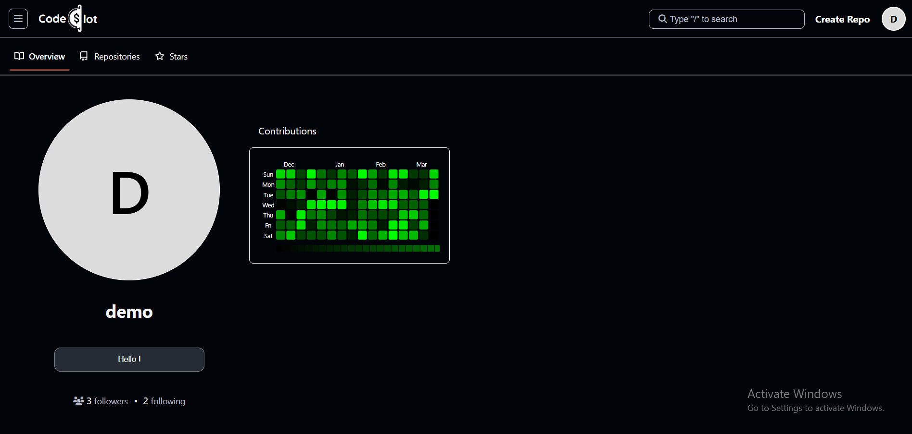

# **CodeSlot Backend**  

 [CodeSlot](https://codeslot.in) is a **React-based** web application that serves as the hosting platform for repositories managed using [Slot](https://github.com/hisarthak/slot), a version control system. The backend is built using **Node.js & Express.js**, hosted on **AWS EC2**, while the frontend is deployed on **AWS Amplify**. The repository data is stored in an **AWS S3 bucket**.

You can visit the website at [codeslot.in](https://codeslot.in). 

## **Key Features**  
- **Host Slot Repositories** – Manage repositories with [Slot's version control](https://github.com/hisarthak/slot).  
- **User Dashboard** – Overview of repositories and activity.  
- **Profile Page** – Manage user details and settings.  
- **Create Repository** – Easily create new repositories.  
- **Search Functionality** – Find repositories & users.  
- **Repository View** – Browse files, folders, and commit history.  
- **Older Commits View** – See past commits & file changes in a commit.  
- **Follow Other Users** – Stay updated with other developers.  
- **Star Repositories** – Save repositories you like.  
- **Commit History** – View all past commits & changes per commit.  

## **Tech Stack** 

### **Data Storage:**  
- Repository data is stored in **AWS S3 Bucket**  

### **Frontend:**  
- React.js    
- ShadCN UI  
- Axios  

### **Backend:**  
- Node.js  
- Express.js  
- MongoDB  
- JWT Authentication  
- Hosted on AWS EC2  

### **Deployment:**  
- **Frontend:** AWS Amplify  
- **Backend:** AWS EC2

## **Frontend Repository**  
The frontend code for CodeSlot is available at:  
🔗 [CodeSlot-Frontend](https://github.com/hisarthak/codeslot-frontend)

## **Website Showcase**  
Here are some previews of **CodeSlot** in action:  

### **Dashboard**  
  

### **Profile Page**  
  

### **Search Page** (Find repositories & users)  
  

### **Repository View**  
  

### **Commit History View** (See commit history & file changes)  
  

##  License  
This project is licensed under [MIT License](LICENSE.txt).  
